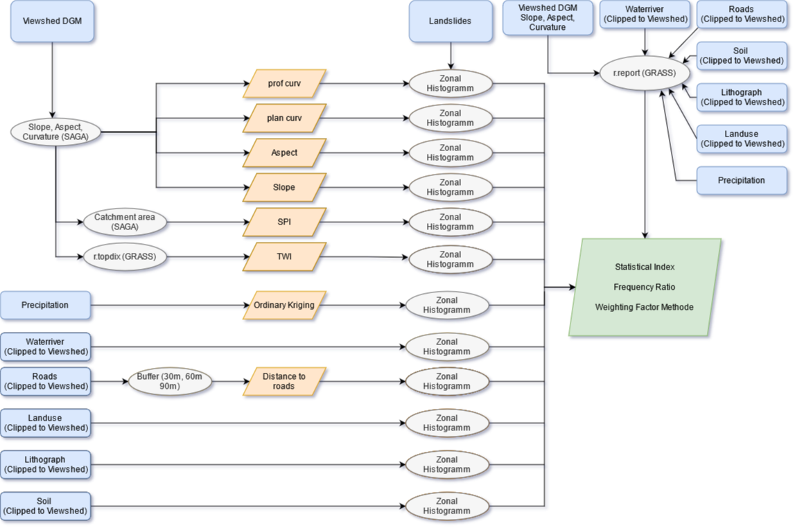

# Analyse der räumlichen Anfälligkeit des Geländes für Hangrutschungen in Zentralvietnam

Dieses Projekt ist im Rahmen des Moduls GEO403 der FSU Jena entstanden, erstellt von *Felix Bachmann*, *Marlin M. Müller*, 
*Maximilian Nestler* und *Jonas Ziemer*, basierend auf den Arbeiten von [Meinhardt et al. (2015)](https://www.sciencedirect.com/science/article/abs/pii/S0169555X15000276?via%3Dihub)

Ziel ist es, eine Risikoanalyse von Hangrutschungen in Zentralvietnam anhand verschiedener statistischer Metriken zu 
erstellen, die durch einen automatisierten Ablauf ermöglicht wird.

Das Modell ermöglicht die Erstellung verschiedener Layer, die relevant für eine Risikoeinschätzung sind. Dafür werden
folgende Datensätze aus den benötigten Basisdaten erstellt:
* Hangneigung
* Hangausrichtung
* Abstand zu Straßen
* Abstand zu Wasserkörpern
* Topographic Wetness Index (TWI)
* Stream Power Index (SPI)
* Oberflächenkrümmung
    * Profilkrümmung 
    * Horizontalkrümmung
* Eigenschaften des Bodens
* Lithologie
* Landnutzung
* Niederschlagsverteilung

Als Basisdaten werden ein DGM, ein Hangrutschungslayer, ein Viewshed, ein Gewässerlayer, ein Straßenlayer sowie Litographie- 
Bodenarten- und Landnutzungslayer vorausgesetzt. Zusätzlich wird noch eine Niederschlagszeitseries benötigt.

*Das Modell wurde mit QGIS 3.16.5 (64 bit) entwickelt und kann zu älteren Versionen inkompatibel sein, Download der 
passenden Version [hier](https://qgis.org/downloads/QGIS-OSGeo4W-3.16.5-1-Setup-x86_64.exe).*

## Workflow-Diagramm des QGIS-Modells

